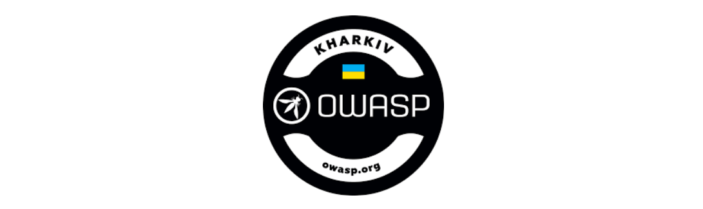
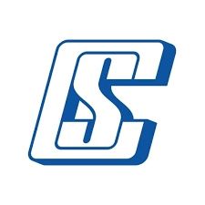
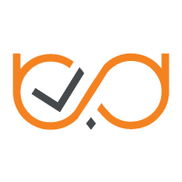
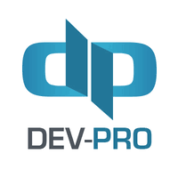
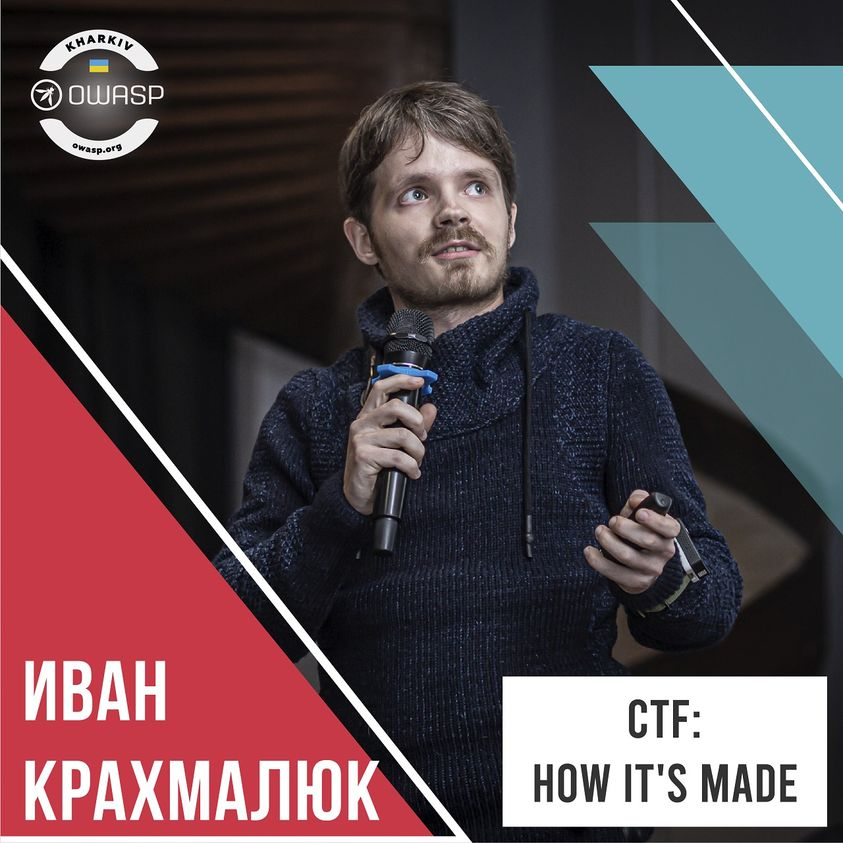
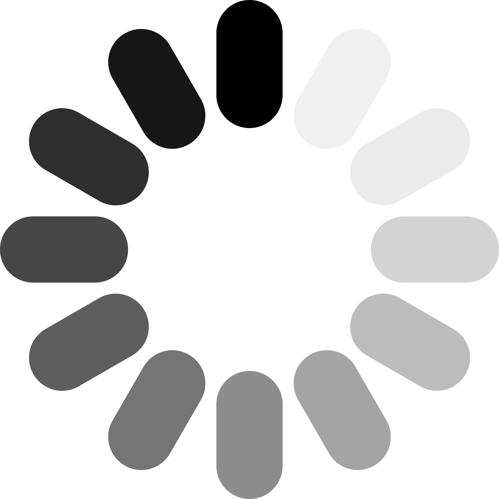

---

layout: col-sidebar
title: OWASP Kharkiv
tags: example-tag
level: 0

region: Europe

---
## Who are we

Welcome to the OWASP Kharkiv chapter homepage.

The chapter is run by a team of dedicated cyber security enthusiasts [Vitalii Balashov](mailto:vitalii.balashov@owasp.org) and [Victoria Paschenko](mailto:victoria.paschenko@owasp.org).

Everyone is welcome to join us at our chapter meetings.

## How to find us

OWASP Kharkiv on social networks:

Follow our news and announcements on social media:
- [Facebook](https://www.facebook.com/owasp.kh/)
- [Telegram](https://t.me/owasp_kharkiv)
- [Instagram](https://www.instagram.com/owasp_kharkiv/)
- [Youtube](https://www.youtube.com/channel/UCHK1l4e9lc7xjZ8lAaKhkrg)

## How to support the chapter

If your company wishes to support the chapter, please contact [Vitalii Balashov](mailto:vitalii.balashov@owasp.org) and [Victoria Paschenko](mailto:victoria.paschenko@owasp.org).

# Future Events

## Become a Speaker

Call For Speakers at OWASP Kharkiv events is permanently open. If you want
to present at future events, review and agree with the [OWASP Speaker
Agreement](Speaker_Agreement "wikilink") and check for upcoming events
at <https://cfp.owaspukraine.org>, or simply send the title and abstract
of your talk and speaker bio to [Vitalii Balashov](mailto:vitalii.balashov@owasp.org) and [Victoria Paschenko](mailto:victoria.paschenko@owasp.org).

## Become a Sponsor

To sponsor an OWASP Kharkiv event, contact [Vitalii Balashov](mailto:vitalii.balashov@owasp.org) and [Victoria Paschenko](mailto:victoria.paschenko@owasp.org).

## Announcements

## Our supporters

### Chapter meeting sponsors

These companies have demonstrated their support for Ukrainian
Application Security community by funding our quarterly chapter
meetings.

  
  
  

## Application Security Conference  

### Chapter Meetup Spring 2019

**Date** Mar 16, 2019

**Location** Student Center of [Kharkiv School of Architecture](https://kharkiv.school/)

### Speakers

- Igor Bakalo - [Secrets. Keys to the kingdom](https://www.youtube.com/watch?v=CC1knihiT6E&list=PL9SNXXIM4tGeaTQ3_lPSE4L4dLnnIgvjc)

- Alexander Beloborodov - [Security of popular server operating systems "in numbers"](https://www.youtube.com/watch?v=t5ppNiw0UO4&list=PL9SNXXIM4tGeaTQ3_lPSE4L4dLnnIgvjc&index=2)

- Dmitry Tereshchenko - [OWASP ASVS 4.0, What's new and How-to-Use it](https://www.youtube.com/watch?v=CdPwUcvpqRA&list=PL9SNXXIM4tGeaTQ3_lPSE4L4dLnnIgvjc&index=3)

- Dmitry Momot - [Browser-based and off-browser user identification methods part 1](https://www.youtube.com/watch?v=uP6zf4QjGtk&list=PL9SNXXIM4tGeaTQ3_lPSE4L4dLnnIgvjc&index=5)

**Translation**  
You can watch the meetup of the [Youtube](https://www.youtube.com/watch?v=CC1knihiT6E&list=PL9SNXXIM4tGeaTQ3_lPSE4L4dLnnIgvjc)

## Sponsors  

  

## Web Application Security Conference

### Chapter Meetup Autumn 2019

**Date** Nov 17, 2019

**Location** Event zone [Fabrika.space](https://fabrika.space/)

### Agenda

  

### Speakers

  

  

  

  

  

  

**Translation**  
You can watch the meetup of the [Youtube](https://www.youtube.com/watch?v=utNBJ7r007M&list=PL9SNXXIM4tGeXMazvrONdXrMrCWXma9dO)

## Sponsors

  
  

## OWASP Interactive

**Date** Apr 10, 2021

**We are working on agenda and will share it here soon.**

  

[Category:OWASP Chapter](Category:OWASP_Chapter "wikilink")
[Category:Ukraine](Category:Ukraine "wikilink")
